# Azerbaijan Real Estate Market Analysis
## Executive Business Intelligence Report

---

## Executive Summary

This report analyzes **16,545 active real estate listings** across Azerbaijan, representing a total market value of **2.67 billion AZN**. The analysis reveals a highly fragmented market dominated by direct owner listings, with significant geographic concentration in Baku and surrounding regions.

### Key Findings

- **Market Size**: 16,545 active listings with median price of 72,000 AZN
- **Geographic Concentration**: Top 3 cities control 63.5% of total inventory
- **Disintermediation**: 84.1% of listings are direct from owners, bypassing agencies
- **Financing Gap**: 78.1% of properties lack mortgage information
- **Engagement Opportunity**: 19.7% of listings attract high interest (300+ views)

---

## 1. Market Composition & Size

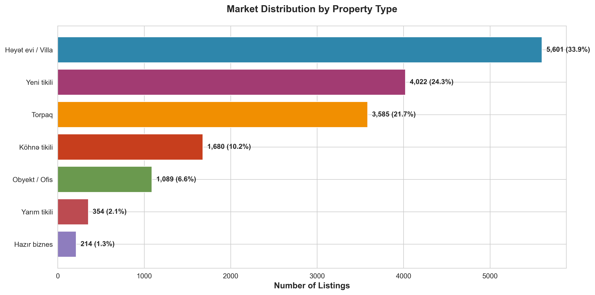

### What This Shows
The market is primarily composed of three property categories: residential villas (33.9%), new construction apartments (24.3%), and land parcels (21.7%). Together, these three segments account for nearly 80% of all listings.

### Why This Matters
**Strategic Implications:**
- **Villa dominance** indicates strong demand for detached housing, likely driven by post-pandemic preferences for space and privacy
- **New construction** represents nearly a quarter of inventory, suggesting robust development activity and modernization trends
- **Land inventory** at 21.7% signals speculative investment and future development potential

**Business Decisions Informed:**
- Marketing strategies should prioritize villa and new construction segments
- Service providers should develop specialized offerings for these dominant categories
- Investors can identify supply-demand imbalances across property types

---

## 2. Price Positioning & Value Distribution

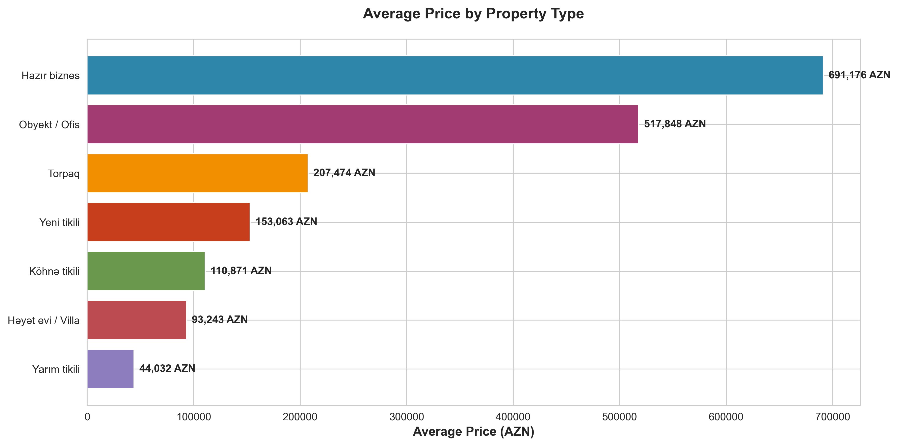

### What This Shows
Commercial properties (business assets and offices) command the highest average prices, while land parcels show high average prices despite wide variance. Residential properties cluster in the mid-range with new construction priced higher than older apartments.

### Why This Matters
**Strategic Implications:**
- **Commercial premium** reflects higher unit economics and investment returns
- **New construction premium** validates market appetite for modern amenities and finishes
- **Price-per-type variance** enables targeted marketing and customer segmentation

**Business Decisions Informed:**
- Portfolio allocation strategies for developers and investors
- Pricing benchmarks for sellers and agents
- Market entry points for different buyer segments

---

## 3. Price Segmentation Analysis

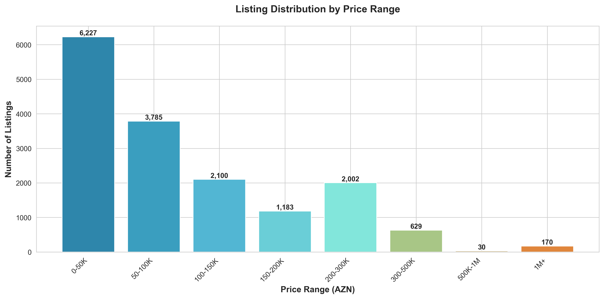

### What This Shows
The market exhibits a clear pyramid structure: 60.5% of listings fall in the entry to budget category (<100K AZN), while only 5% occupy the luxury tier (>300K AZN). The median price of 72,000 AZN falls well below the average of 165,592 AZN, indicating a long tail of high-value properties.

### Why This Matters
**Strategic Implications:**
- **Mass market dominance** in the <100K segment presents volume opportunities
- **Median-mean gap** reveals wealth concentration and premium segment opportunities
- **Thin luxury tier** suggests unmet demand or supply constraints at high price points

**Business Decisions Informed:**
- Product development should focus on affordable and mid-tier offerings
- Premium service providers face limited addressable market
- Financing solutions are critical for the 60% of buyers in entry/budget segments

---

## 4. Geographic Market Dynamics

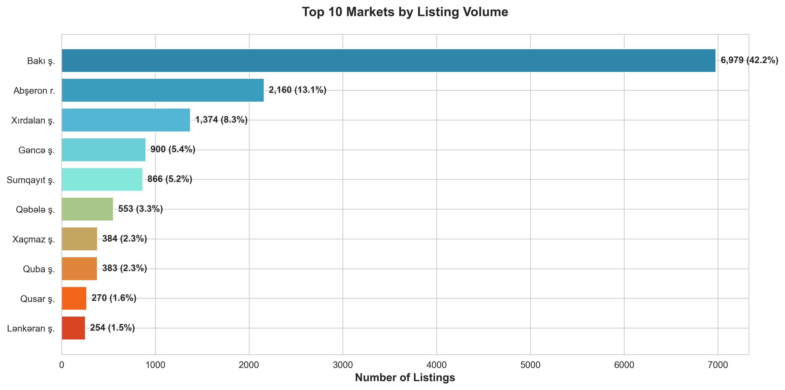

### What This Shows
Baku dominates with 42.2% of all listings, followed by Absheron region (13.1%) and Xirdalan (8.3%). The top three markets control 63.5% of inventory, while the remaining 36.5% is distributed across 61 smaller cities.

### Why This Matters
**Strategic Implications:**
- **Capital concentration** creates both economies of scale and intense competition in Baku
- **Suburban growth** in Absheron and Xirdalan indicates urban sprawl and commuter demand
- **Regional fragmentation** offers expansion opportunities but requires localized strategies

**Business Decisions Informed:**
- Market entry and expansion prioritization
- Resource allocation across geographies
- Partnership and franchise opportunities in underserved regions

---

## 5. Regional Price Comparison

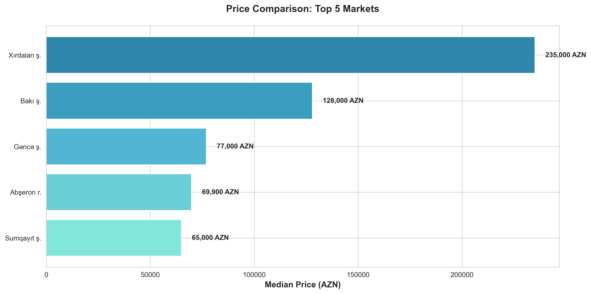

### What This Shows
Xirdalan commands the highest median prices among top markets (235,000 AZN), followed by Baku (128,000 AZN). Regional cities like Ganja, Sumqayit, and Khachmaz show significantly lower price points (65,000-77,000 AZN).

### Why This Matters
**Strategic Implications:**
- **Xirdalan premium** suggests affluent suburban demand and limited supply
- **Baku pricing power** reflects capital city advantages: jobs, amenities, infrastructure
- **Regional discount** presents affordability for buyers and lower entry costs for investors

**Business Decisions Informed:**
- Site selection for new development projects
- Migration and relocation trend analysis
- Investment arbitrage opportunities between markets

---

## 6. Value Efficiency Metrics

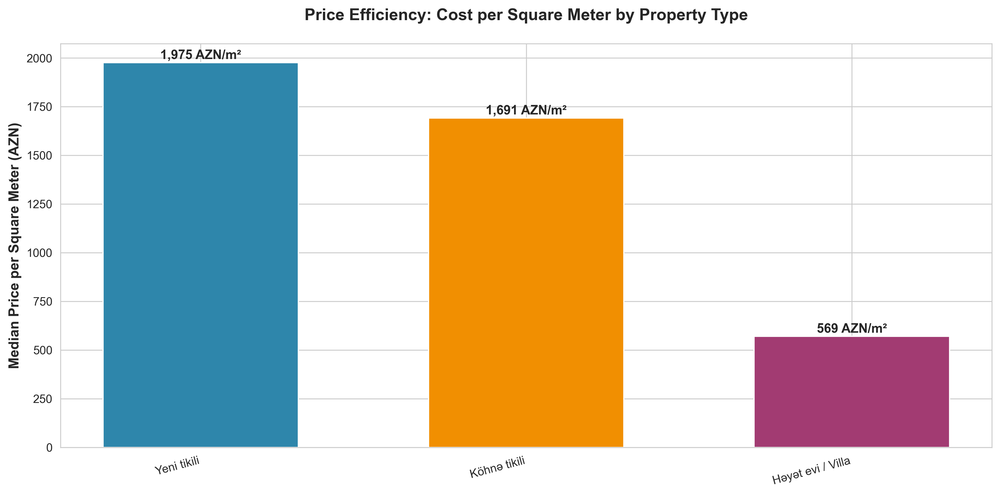

### What This Shows
New construction apartments cost 1,975 AZN per square meter, 17% more than older apartments (1,691 AZN/m²). Villas offer the lowest price per square meter (569 AZN/m²) but typically require much larger total investments due to size.

### Why This Matters
**Strategic Implications:**
- **New construction premium** reflects quality, amenities, and modern design preferences
- **Villa efficiency** appeals to space-conscious buyers willing to trade location for size
- **Cost-per-meter variance** enables value-based positioning strategies

**Business Decisions Informed:**
- Development feasibility and pro forma modeling
- Buyer education on value vs. price
- Renovation and repositioning strategies for older stock

---

## 7. Seller Landscape & Market Structure

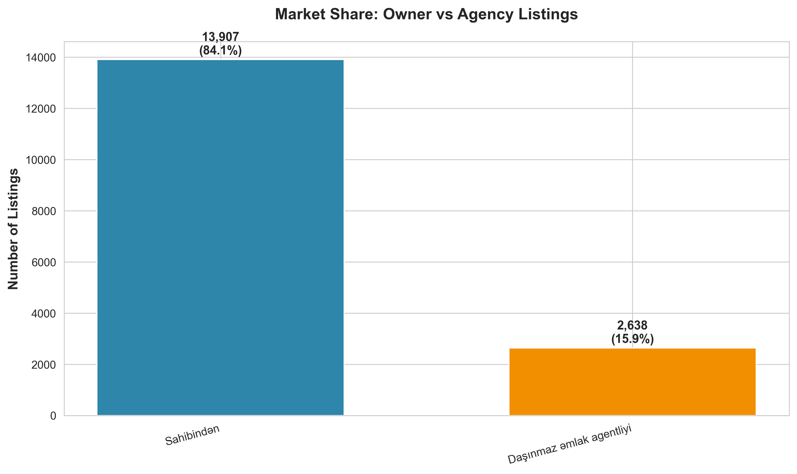

### What This Shows
Direct owner listings (84.1%) overwhelmingly dominate agency-brokered transactions (15.9%), representing one of the highest disintermediation rates in real estate markets globally.

### Why This Matters
**Strategic Implications:**
- **Limited agency penetration** signals market inefficiency and professional service gap
- **Direct selling preference** may reflect commission sensitivity and trust issues
- **Agency opportunity** exists to capture value through superior service and expertise

**Business Decisions Informed:**
- Agency value proposition development
- Owner education and marketing campaigns
- Digital platform opportunities to serve owner-sellers

---

## 8. Legal Documentation & Transaction Readiness

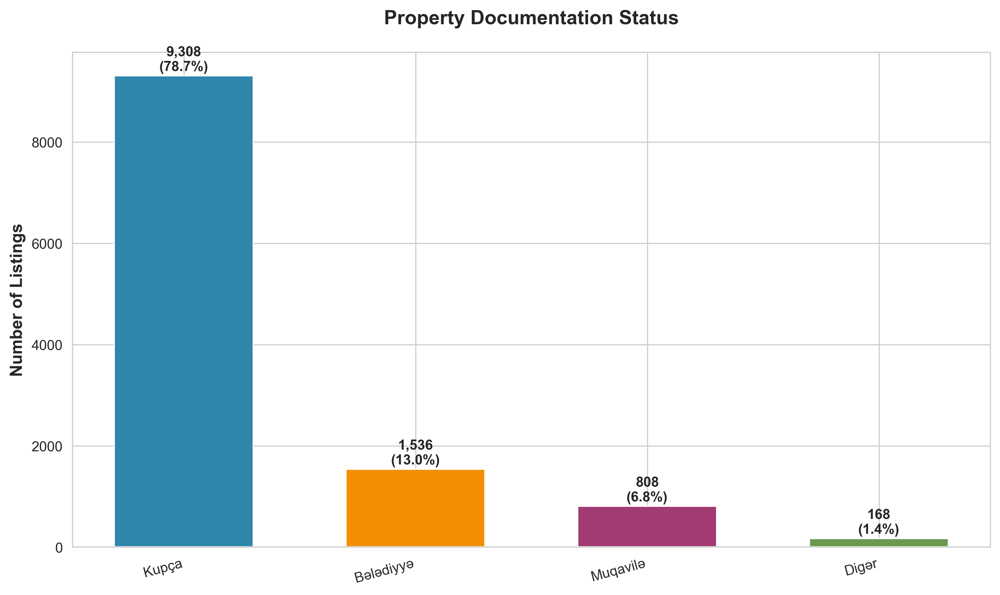

### What This Shows
71.4% of listings have clear legal documentation, with "Kupcha" (property deed) representing 56.3% of all listings. However, 28.6% of properties lack specified documentation status.

### Why This Matters
**Strategic Implications:**
- **High documentation rate** suggests relatively mature property rights infrastructure
- **Documentation gap** creates friction in 28.6% of potential transactions
- **Title clarity** differentiates ready-to-transact inventory from problematic assets

**Business Decisions Informed:**
- Due diligence requirements and timeline planning
- Risk assessment and pricing adjustments
- Legal service demand forecasting

---

## 9. Financing Accessibility

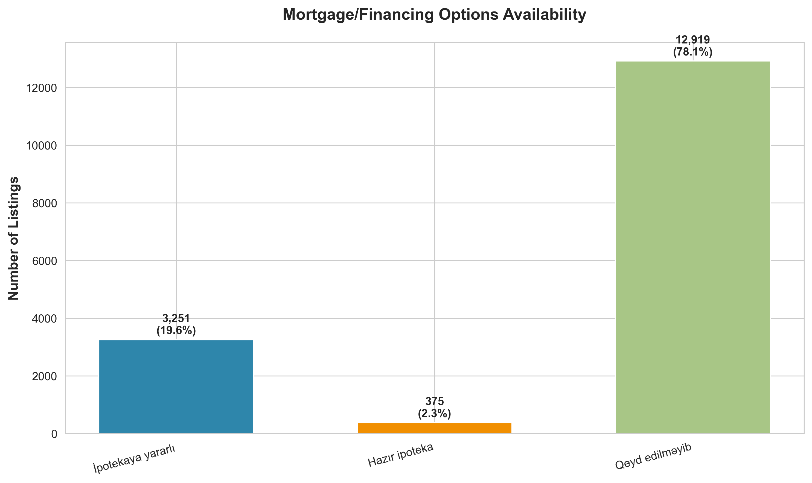

### What This Shows
Only 21.9% of listings explicitly offer mortgage options, with 78.1% providing no financing information. Of mortgage-ready properties, most are "eligible" (3,251) rather than having active financing (375).

### Why This Matters
**Strategic Implications:**
- **Massive financing gap** constrains market liquidity and transaction velocity
- **Information asymmetry** forces buyers to research financing independently
- **Mortgage penetration opportunity** could unlock demand from 78% of listings

**Business Decisions Informed:**
- Partnership opportunities with financial institutions
- Listing optimization to highlight financing options
- Market education on mortgage benefits and processes

---

## 10. Furnished Property Market

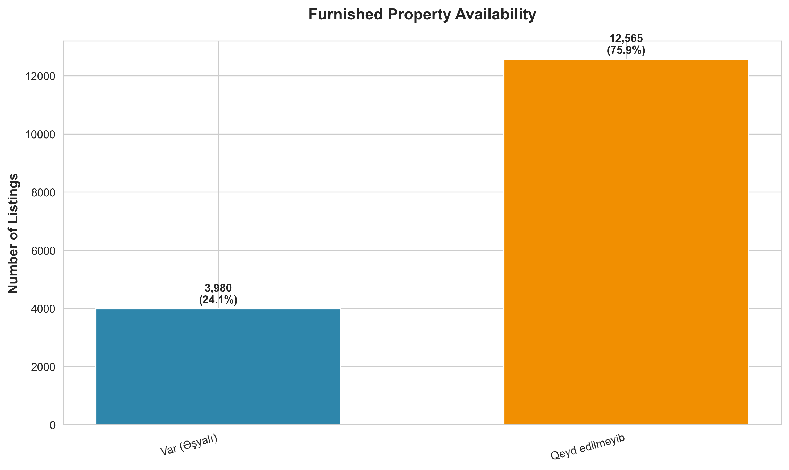

### What This Shows
The furnished vs. unfurnished split shows market preference patterns, with the majority lacking furniture specification information.

### Why This Matters
**Strategic Implications:**
- **Furnishing status** impacts rental potential and buyer demographics
- **Information gaps** suggest listing quality improvement opportunities
- **Furnished premium** can be quantified for seller guidance

**Business Decisions Informed:**
- Staging and presentation strategies
- Target customer segmentation (investors vs. owner-occupants)
- Value-add service offerings

---

## 11. Market Activity & Momentum

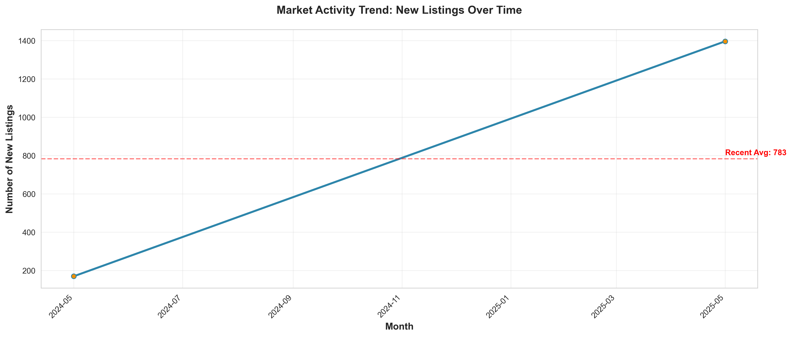

### What This Shows
New listing volume over time reveals seasonality, growth trends, and market momentum. The trend line indicates recent 3-month average activity levels.

### Why This Matters
**Strategic Implications:**
- **Volume trends** signal market confidence and economic health
- **Seasonal patterns** inform timing of marketing campaigns and product launches
- **Momentum indicators** guide inventory management and pricing strategies

**Business Decisions Informed:**
- Sales and marketing calendar planning
- Staffing and resource allocation
- Market timing for buyers and sellers

---

## 12. Customer Engagement & Interest Patterns

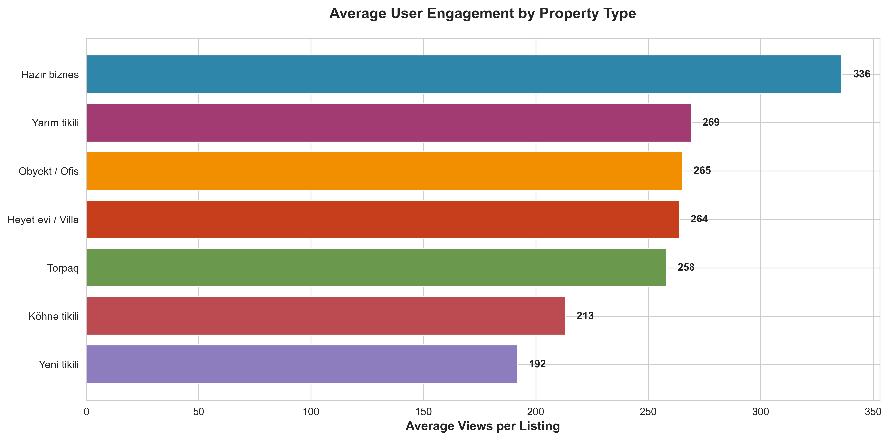

### What This Shows
Business properties generate the highest average engagement (336 views), while new construction apartments receive the lowest (192 views). However, 19.7% of all listings achieve "high interest" status (300+ views).

### Why This Matters
**Strategic Implications:**
- **Engagement variance** reveals what captures buyer attention
- **Business property interest** reflects investment-oriented platform users
- **Underperforming listings** (9.6% with <100 views) need optimization

**Business Decisions Informed:**
- Listing optimization and photography quality improvements
- Content strategy for high-engagement property types
- Performance benchmarking and seller coaching

---

## Strategic Recommendations

### 1. Address the Financing Information Gap
**Opportunity**: 78.1% of listings lack mortgage information, creating friction for 60% of buyers in the affordable segment (<100K AZN).

**Action**:
- Partner with banks to pre-qualify properties
- Add mortgage calculators to listings
- Educate sellers on financing as a competitive advantage

### 2. Professionalize the Owner-Direct Market
**Opportunity**: 84.1% of sellers operate without professional representation, likely leaving value on the table.

**Action**:
- Develop low-cost or commission-free service tiers
- Offer unbundled services (pricing, photography, legal)
- Build trust through transparency and education

### 3. Capitalize on Geographic Concentration
**Opportunity**: 63.5% of inventory concentrated in three markets enables focused strategy.

**Action**:
- Achieve market leadership in Baku/Absheron/Xirdalan
- Build scalable operations before regional expansion
- Leverage density for offline marketing and networking

### 4. Optimize the Long Tail
**Opportunity**: 9.6% of listings attract <100 views, representing wasted marketing investment.

**Action**:
- Implement listing quality scores and improvement tools
- Provide seller education on photography and descriptions
- Use dynamic pricing recommendations to accelerate stale inventory

### 5. Target High-Intent Segments
**Opportunity**: Business/commercial properties show 75% higher engagement than new construction.

**Action**:
- Develop specialized commercial platform features
- Build investor-focused tools (ROI calculators, rental yield data)
- Create premium service tier for high-value transactions

---

## Market Size & Opportunity Metrics

| Metric | Value | Insight |
|--------|-------|---------|
| **Total Active Listings** | 16,545 | Substantial inventory depth |
| **Total Market Value** | 2.67B AZN | Significant transaction opportunity |
| **Median Price** | 72,000 AZN | Affordable entry point for mass market |
| **Average Engagement** | 241 views | Strong platform activity |
| **Owner-Direct Rate** | 84.1% | Disintermediation opportunity |
| **Top 3 City Share** | 63.5% | Geographic concentration |
| **Premium Segment** | 17.3% >200K | Emerging affluent buyer class |
| **Mortgage Gap** | 78.1% | Financing education needed |

---

## Conclusion

The Azerbaijan real estate market presents a compelling opportunity characterized by:

1. **Scale**: Over 16,000 active listings with 2.67B AZN in total value
2. **Inefficiency**: High disintermediation rate and information gaps create service opportunities
3. **Growth**: New construction at 24.3% signals modernization and rising standards
4. **Accessibility**: 60% of inventory priced under 100K AZN enables mass market participation

Success in this market requires addressing the financing information gap, professionalizing the owner-direct segment, and leveraging geographic concentration in Baku and suburbs. Organizations that combine technology, education, and trust-building will capture disproportionate value as the market matures.

---

*Analysis based on 16,545 active listings as of the data collection period. All charts and metrics derived from publicly available listing data.*
